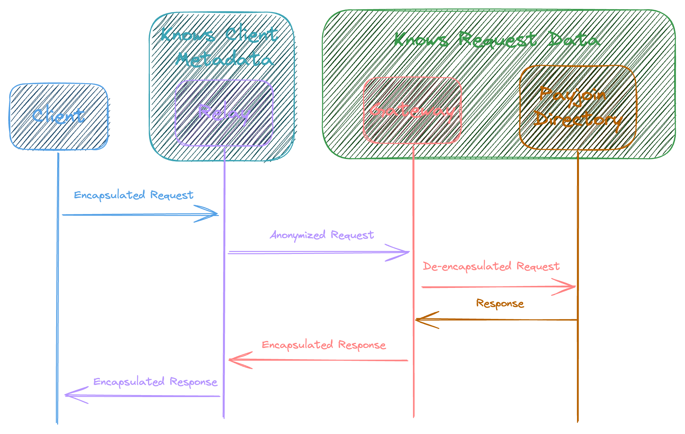

:::note

BIP 77 is still a draft BIP. Use at your own risk!

:::

### Motivation

Payjoin version 2 ([BIP 77](https://github.com/bitcoin/bips/blob/bc3123e1dab1c5b08d6f934b11b4d741107ac386/bip-0077.mediawiki)) is a draft BIP designed to improve on the primary limitations of version 1. In version 1, a receiver was required to have a server from which to send the [BIP 21 URI](todo) as well as modify the **Original PSBT** from the sender into a **Payjoin PSBT**.

Payjoin v2 eliminates this requirement by outsourcing the server called a _directory_ to an untrusted third party. This server is dead simple and has one task -- store pending payments from the sender, and forward them to the receiver when they come back online. These in-flight payment messages are small, ephemeral, and encrypted, so a malicious directory cannot snoop on or forge message contents.

To make this work, in lieu of hosting a server themselves, the receiver starts a session with the directory to request a _subdirectory_ which will contain the encrypted payment PSBTs between the sender and receiver.

That's all well and good, but what about the metadata being sent to the payjoin directory? After all, even if the untrusted directory couldn't see the actual transaction data, couldn't they see the sender and receiver's IP addresses and other metadata? Typically, yes, but payjoin v2 makes use of a novel protocol called [_Oblivious HTTP_](https://www.fastly.com/blog/enabling-privacy-on-the-internet-with-oblivious-http) to strip client identifying metadata from the request before it reaches the directory.

Aside from these two changes in the means of communicating the transaction, the protocol remains largely the same as v1. V2 is also backward-compatible with v1.

Payjoin v2 improves upon the ease-of-use by eliminating the need for the sender and receiver to be online at the same time, or for either to ever run any servers to do so. Unlike v1, it is both serverless and asynchronous, removing the primary barriers to adoption that v1 faced.

### Protocol

:::info

All requests made to the directory by the sender or receiver are done using OHTTP, so that the directory doesn't know any of their identifying metadata. OHTTP is explained below.

:::

At a high level (and omitting some important detail), a payjoin v2 transaction takes the following steps:

- **Receiver**: Sends their payjoin pubkey to the directory to _enroll_ for a subdirectory on it.
- **Receiver**: Out of band, the receiver of the payment shares a bitcoin URI with the sender including a `pj=` query parameter with the subdirectory. An `ohttp=` parameter containing the directory's public key should also be provided.
- **Sender**: Creates an **Original PSBT** and sends it to the directory.
- **Sender**: Continues to replay this request in order to await a response from the directory containing a `Payjoin PSBT`. It stops after a designated expiration time.
- The request is stored in the **subdirectory**.
- Once the receiver is online, it sends `/receive` requests to await updates from the subdirectory. The receiver decrypts and authenticates the response which it checks according to [the receiver checklist](https://github.com/bitcoin/bips/blob/master/bip-0078.mediawiki#receivers-original-psbt-checklist). It updates the Original PSBT to include new signed inputs and outputs, invalidating sender signatures, and may adjust the fee. The result is called the `Payjoin PSBT`.
- The `Payjoin PSBT` and HPKE keys are encrypted, authenticated, encapsulated in OHTTP, and sent to the directory's OHTTP Gateway.
- The directory awaits a request from the sender if it goes offline. Upon request, it relays the encrypted `Payjoin PSBT`.
- The sender validates the `Payjoin PSBT` according to [the sender checklist](https://github.com/bitcoin/bips/blob/bc3123e1dab1c5b08d6f934b11b4d741107ac386/bip-0077.mediawiki#senders-payjoin-psbt-checklist), signs its inputs and broadcasts the transaction to the Bitcoin network.

### OHTTP

[Oblivious HTTP](https://www.fastly.com/blog/enabling-privacy-on-the-internet-with-oblivious-http) works by separating who can see the client's metadata from who can see the actual request. There are four layers to the OHTTP architecture:

- Client
- Relay
- Gateway
- Target
  The _client_ is trying to make a request to the _target_ in such a way that the target can only see the actual request, not the client's metadata.

1. The Client encapsulates and encrypts a request intended for the target and sends it to the relay.
2. The Relay receives the encapsulated request and can see client metadata and HTTP headers, strips them, and sends the encapsulated request to the Gateway. This means that the relay knows identifying details about the Client. The encapsulated request is encrypted with a key the Relay doesn't have, so the Relay doesn't know what data has been sent to the Client, only the metadata.
3. The Gateway receives the anonymized version of the Client's request from the Relay, decrypts and de-encapsulates it, and then forwards it to the Target. The Gateway doesn't know identifying information about the Client.
4. The Target receives the request as a normal HTTP request without knowing any metadata about the Client, processes the request, and sends it back to the Gateway. The Gateway re-encapsulates/encrypts the response and sends it back through the Relay to the Client.

To learn more about payjoin v2, dive into [BIP 77](https://github.com/bitcoin/bips/blob/bc3123e1dab1c5b08d6f934b11b4d741107ac386/bip-0077.mediawiki) or complete one of the tutorials!
